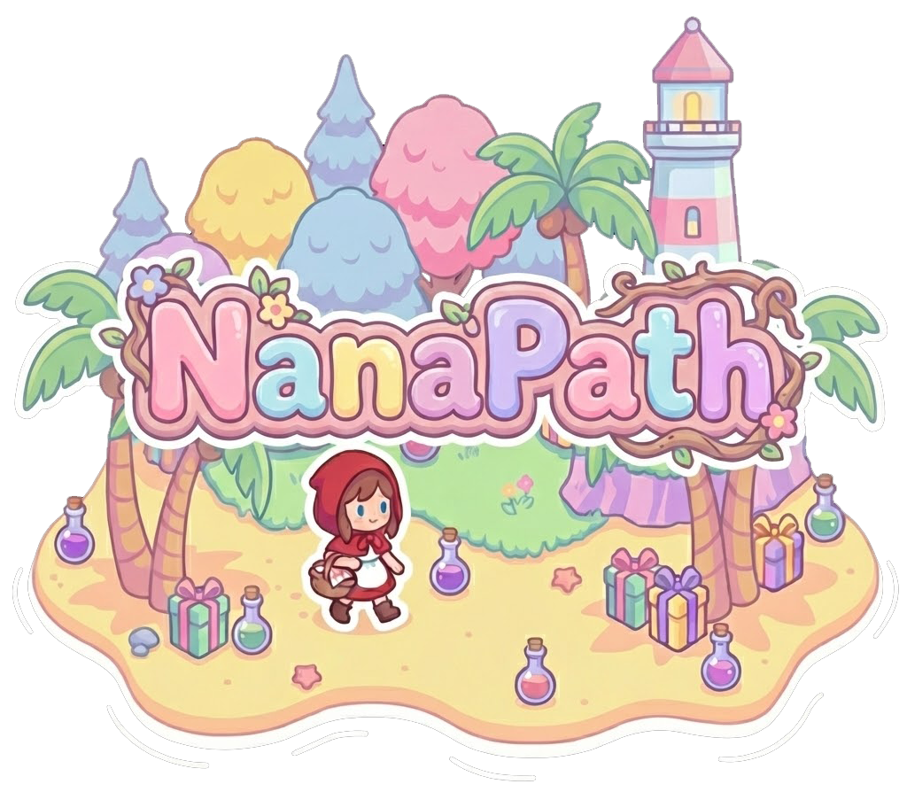

# NanaPath

## Objetivo

### Chapeuzinho se perdeu e está à procura da casa da vovó!
NanaPath é um jogo de exploração em que o jogador precisa guiar essa pobre menininha por uma ilha repleta de poções e presentes duvidosos, enquanto tenta escapar dos ataques disfarçados do lobo mau.

A aventura é dividida em níveis, cada um com inimigos, armadilhas e itens distribuídos de forma aleatória, incentivando a exploração constante do mapa. Para avançar, o jogador deve encontrar saídas escondidas e coletar os dois tesouros que ajudarão Chapeuzinho a reencontrar sua amada vovozinha.

### Tipo de Jogo
Um jogo de aventura e exploração inspirado em ToeJam & Earl, com temática de conto de fadas.

### Diferencial
O jogo utiliza **geração procedural** para criar os mapas e elementos do cenário.

## Mecânica
Nesse protótipo serão implementados cinco níveis. O jogo terá uma versão “random”, em que os mapas serão gerados com sementes aleatórias e a versão fixa com as sementes iguais em todas as execuções do jogo.

### Pontuação
As duas formas de pontuar são:

 1) Coletando presentes (todos pontuam);
 2) Revelando áreas escondidas do mapa.

* `Poção:` +1 ponto;
* `Presente:` +2 pontos;
* `Tesouro:` +5 pontos;
* `Nova área:` +10 pontos (incentivar a exploração?);

### Poções
Interferem apenas na vida do jogador. Serão 5 poções de cores e efeitos diferentes que irão mudar sempre que o jogo for reiniciado.

Ex.: em uma partida, a poção vermelha pode restaurar 5 pontos de vida, enquanto na seguinte ela pode causar –3 de dano.

### Presentes
São itens com efeitos diversos, desconhecidos até o primeiro uso.

Ao identificar o efeito de um tipo de presente, todos os semelhantes no inventário também serão revelados.

Cada tipo possui uma probabilidade diferente de aparecer no mapa.

* `Tipo 1:` aumenta a velocidade do personagem. Dura 30 segundos;
* `Tipo 2:` revela 2 partes escondidas do mapa;
* `Tipo 3:` concede 1 vida extra;
* `Tipo 4:` permite andar sobre a água sem sofrer dano. Dura 30 segundos;
* `Tipo 5:` faz o player dormir por 10 segundos;
* `Tipo 6:` UnFall. Avança para o mapa seguinte se estiver desbloqueado; (em aberto)
* `Tipo 7:` morte instantânea;
* `Tipo 8:` recupera metade da vida faltante;

### Tesouros
Para zerar o jogo, os dois tesouros devem ser coletados. Um tesouro será alocado aleatoriamente entre os níveis 2 e 4. O último tesou sempre estará no último nível. O jogador será avisado quando tiver um tesouro no mapa.

### NPCs
Em construção…

### Em aberto
- Fazer com que o jogador possa "cair" no mapa anterior (depende da construção do mapa);

### Fora do escopo
- Perspectiva 3/4;

Detalhes serão adicionados ou modificados no decorrer do desenvolvimento do jogo conforme o grupo for verificando a viabilidade da implementação das mecânicas idealizadas.

